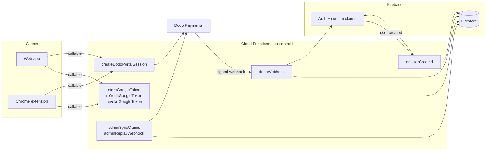

# NoteHub LM — Cloud Functions

Firebase Cloud Functions backend for **NoteHub LM**, an AI-powered note-taking app.

This service is the trusted server tier between NoteHub LM's clients (web app and
Chrome extension) and two third parties: **Dodo Payments** for billing and
**Google OAuth** for Drive access. It exists so that two classes of secret — the
payment provider's API key and the Google OAuth client secret — never reach a
browser.

It does three jobs:

1. **Billing state** — receives and verifies Dodo Payments webhooks, and projects
   subscription state into Firestore and Firebase Auth custom claims so clients
   can gate paid features from an ID token alone.
2. **OAuth token brokerage** — exchanges Google authorization codes for tokens,
   stores the refresh token server-side, and hands clients short-lived access
   tokens on demand. The refresh token is never exposed to a client.
3. **Account reconciliation** — links purchases made *before* sign-up to the
   Firebase account created later, plus admin endpoints to repair drift.

> **Status:** this repository is published for reference and is not a
> general-purpose template. It is wired to a specific Firebase project and Dodo
> account, and running it requires credentials you will not have. See
> [LICENSE](LICENSE) — the source is viewable, but no reuse rights are granted.

---

## Contents

- [Architecture at a glance](#architecture-at-a-glance)
- [Tech stack](#tech-stack)
- [Repository layout](#repository-layout)
- [The functions](#the-functions)
- [Data model](#data-model)
- [Configuration](#configuration)
- [Local development](#local-development)
- [Deployment](#deployment)
- [Security](#security)
- [Further reading](#further-reading)

---

## Architecture at a glance



Two invariants shape the whole design:

- **Firestore is write-denied to clients.** Every document in `customers`,
  `user_tokens`, and `webhook_events` is written only by these functions.
  Clients read their own `customers` document and nothing else.
- **Claims are derived, never authoritative.** Firestore is the source of truth;
  Auth custom claims are a cache of it for cheap client-side gating. Every write
  path can be replayed to rebuild claims, which is what the admin endpoints are for.

---

## Tech stack

| Layer | Technology |
|---|---|
| Runtime | Node.js 22 |
| Language | TypeScript 5.4 (`strict`, NodeNext modules) |
| Framework | Firebase Functions v2 (HTTP + callable), v1 (Auth trigger) |
| Database | Cloud Firestore |
| Auth | Firebase Authentication + custom claims |
| Payments | Dodo Payments SDK v2.29 |
| Webhook verification | [`standardwebhooks`](https://www.standardwebhooks.com/) v1.0 |
| OAuth | `google-auth-library` v10 |
| Build output | `lib/` (compiled from `src/`) |

---

## Repository layout

```
src/
  index.ts              Entry point — exports all 8 functions, sets global options + CORS
  types.ts              Shared TypeScript interfaces (source of truth for shapes)
  config.ts             Firebase param/secret definitions + productIdToPlan()

  webhook/
    handler.ts          Webhook dispatcher: verify → claim → route → batch-write → claims
    verify.ts           Standard Webhooks signature verification

  auth/
    onUserCreated.ts    Auth trigger: links a pre-registration Dodo purchase to a new user

  admin/
    auth.ts             checkAdminSecret() — timing-safe header validation
    syncClaims.ts       Rebuild Auth claims from Firestore
    replayWebhook.ts    Re-fetch authoritative state from the Dodo API

  token/
    store.ts            Exchange a Google auth code; persist refresh token; mint custom token
    refresh.ts          Trade the stored refresh token for a fresh access token
    revoke.ts           Revoke at Google and delete the stored token

  customer/
    portal.ts           Create a Dodo customer-portal session for the signed-in user

  events/
    subscription.ts     Maps Dodo subscription events → SubscriptionResult
    payment.ts          Structured logging for payment/refund events

  firebase/
    admin.ts            Singleton Admin SDK init (exports db, auth, FieldValue)
    firestore.ts        All Firestore read/write helpers
    claims.ts           setSubscriptionClaims(), buildClaimsFromCustomerDoc()
    userLookup.ts       resolveCustomerAndUid() — customer doc → UID resolution

firebase.json           Functions, Firestore, and emulator configuration
firestore.rules         Security rules (deny-by-default)
firestore.indexes.json  Field overrides (customers.firebaseUid ASCENDING)
.firebaserc             Project aliases: default/staging → dev, prod → prod
```

---

## The functions

All functions share global options: region `us-central1`, max 10 instances,
60s timeout, 256 MiB memory.

### Billing

#### `dodoWebhook` — HTTP POST

The only unauthenticated HTTP surface, protected by signature verification.

1. Verify the Standard Webhooks signature over the **raw** body (`401` on failure).
2. Atomically claim the `webhook-id` via a Firestore `create()` — a duplicate
   delivery loses the race and returns early. This is the idempotency gate.
3. Route the event to the subscription or payment handler.
4. Resolve the Firebase UID for the customer (may be `null` pre-signup).
5. Commit customer state and the processed marker in a single batch.
6. Set Auth custom claims, if a UID is known.

If the batch commit fails, the webhook claim is **released** so that Dodo's retry
can reprocess the event rather than being silently swallowed as a duplicate.
A claims failure after a successful commit is logged but not fatal — Firestore
already holds the truth, and claims re-derive on next login or replay.

| Event | Resulting status |
|---|---|
| `subscription.active`, `subscription.renewed`, `subscription.plan_changed` | `active` |
| `subscription.cancelled` | `cancelled` (period end retained for "access until X") |
| `subscription.on_hold` | `on_hold` |
| `subscription.expired` | `expired` (plan + period end cleared) |
| `subscription.failed` | `none` (plan + period end cleared) |
| `payment.failed` with an active subscription | downgraded to `on_hold` |
| `payment.succeeded`, `refund.succeeded` | logged only, no state change |

#### `createDodoPortalSession` — callable, authenticated

Resolves the caller's Dodo customer from their UID, requires an `active`
subscription, and returns a time-bound portal link. The Dodo API key stays server-side.

### Google OAuth token brokerage

The clients use Google Identity Services with `ux_mode: 'popup'` and
`prompt: 'consent'`, then hand the resulting authorization code to these functions.
The Google **client secret** and the **refresh token** never leave the server.

| Function | Auth | Purpose |
|---|---|---|
| `storeGoogleToken` | none — see below | Exchange auth code → tokens, verify `id_token`, find-or-create the Firebase user, persist the refresh token, return a Firebase custom token |
| `refreshGoogleToken` | `request.auth` required | Exchange the stored refresh token for a fresh access token; rotates and re-persists if Google issues a new refresh token; deletes the record on `invalid_grant` |
| `revokeGoogleToken` | `request.auth` required | Best-effort revoke at Google, then delete the stored record |

`storeGoogleToken` is deliberately unauthenticated: it *bootstraps* the Firebase
session, so no session can exist yet. The authorization code is itself the
credential — it is single-use, bound to the client ID, and redeemable only with
the client secret. The returned `id_token` is verified with its audience pinned
to `GOOGLE_CLIENT_ID` before any user is created.

### Account lifecycle

#### `onUserCreated` — Auth trigger (v1)

Fires on Firebase user creation and links purchases made before sign-up.

Because linking is keyed on **email**, the trigger refuses to link unless the
email is verified — either `emailVerified` is set, or sign-in came through a
provider that guarantees it (currently `google.com`). Without that check, signing
up with an unverified address matching someone else's purchase would inherit
their subscription.

### Admin endpoints

Both require an `x-admin-secret` header and are intended for manual operator use.

| Function | Body | Purpose |
|---|---|---|
| `adminSyncClaims` | `{ email? \| uid? \| customerId? }` | Rebuild Auth claims from what Firestore already holds. Fixes claim drift. |
| `adminReplayWebhook` | `{ customerId, subscriptionId? }` | Re-fetch subscription state from the Dodo API and rewrite Firestore + claims. Fixes a missed or mishandled webhook. |

---

## Data model

### `customers/{dodoCustomerId}`

Keyed by the Dodo customer ID, so a purchase can exist before any Firebase account does.

```typescript
interface CustomerDoc {
  email: string;
  firebaseUid: string | null;          // null until a Firebase account exists
  subscriptionStatus: 'active' | 'cancelled' | 'expired' | 'on_hold' | 'none';
  subscriptionPlan: 'pro_monthly' | 'pro_yearly' | null;
  subscriptionId: string | null;
  currentPeriodEnd: string | null;     // ISO date string
  updatedAt: Timestamp;                // always a server timestamp
  lastWebhookEvent: string;            // e.g. "subscription.active"
}
```

`firebaseUid` carries an ASCENDING field override so `queryCustomerByUid` can run.

### `user_tokens/{uid}`

```typescript
interface UserTokenDoc {
  googleRefreshToken: string;          // server-only, never returned to a client
  scope: string;
  updatedAt: Timestamp;
}
```

Fully denied to clients by security rules.

### `webhook_events/{webhookId}`

```typescript
interface WebhookEventDoc {
  receivedAt?: Timestamp;              // set when the ID is atomically claimed
  processedAt: Timestamp;              // set once processing succeeds
  eventType: string;
}
```

Exists purely for idempotency and audit. Admin replays write a synthetic
`admin_replay_<customerId>_<epochMs>` ID that can never collide with a real
webhook ID.

### Auth custom claims

```typescript
interface SubscriptionClaims {
  subscriptionStatus: SubscriptionStatus;
  subscriptionPlan: SubscriptionPlan | null;
  subscriptionId: string | null;
  customerId: string | null;
  currentPeriodEnd: string | null;
}
```

Set server-side only and merged over any existing claims. Clients read them from
the ID token to gate paid features.

---

## Configuration

Values are declared in [`src/config.ts`](src/config.ts) with `defineSecret()` and
`defineString()`. See [`.env.example`](.env.example) for a template.

| Variable | Kind | Required for | Purpose |
|---|---|---|---|
| `DODO_PAYMENTS_WEBHOOK_SECRET` | secret | `dodoWebhook` | Webhook signature verification |
| `DODO_PAYMENTS_API_KEY` | secret | `adminReplayWebhook`, `createDodoPortalSession` | Dodo REST API calls |
| `GOOGLE_CLIENT_SECRET` | secret | `storeGoogleToken`, `refreshGoogleToken` | OAuth code/refresh exchange |
| `ADMIN_SECRET` | secret | admin endpoints | `x-admin-secret` validation |
| `GOOGLE_CLIENT_ID` | string | token functions | OAuth client ID; also the pinned `id_token` audience |
| `DODO_PRODUCT_ID_PRO_MONTHLY` | string | all | Maps a Dodo product ID → `pro_monthly` |
| `DODO_PRODUCT_ID_PRO_YEARLY` | string | all | Maps a Dodo product ID → `pro_yearly` |
| `DODO_ENV` | string | all | `test_mode` (default) or `live_mode` |
| `ALLOWED_ORIGINS` | string | callable functions | Comma-separated CORS allowlist. Fails closed — empty rejects all cross-origin calls |

### Environment strategy

The Firebase CLI resolves `.env` files in order, with later files overriding
earlier: `.env` → `.env.<projectId>`. `.env.local` is emulator-only and is never
deployed.

| Alias | Project | `DODO_ENV` | Config file |
|---|---|---|---|
| `default` / `staging` | `notehublm-a2490` | `test_mode` | `.env.notehublm-a2490` |
| `prod` | `notehublm-prod` | `live_mode` | `.env.notehublm-prod` |

Two deliberate fail-safes:

- `DODO_ENV` defaults to `test_mode` in code, so a missing value can never
  accidentally transact against live payments.
- Each project file fully specifies its environment rather than relying on
  inheritance, so reading one file tells you the whole story.

**The committed `.env.<projectId>` files contain non-secret configuration only** —
product IDs, the public OAuth client ID, and origin allowlists. Secrets are set
per project through Secret Manager and never appear in a committed file:

```bash
firebase functions:secrets:set DODO_PAYMENTS_WEBHOOK_SECRET --project prod
```

---

## Local development

```bash
npm install
cp .env.example .env.local     # then fill in real values — .env.local is gitignored
npm run serve                  # build + start the emulator suite
```

| Script | Does |
|---|---|
| `npm run build` | `tsc` — compile `src/` → `lib/` |
| `npm run build:watch` | Compile in watch mode |
| `npm run typecheck` | Type check without emitting |
| `npm run lint` | `eslint src/` |
| `npm run serve` | Build, then start the functions, Firestore, and Auth emulators |
| `npm run deploy` | `firebase deploy --only functions` |

Emulator ports: functions `5001`, Firestore `8080`, Auth `9099`, UI `4000`.

---

## Deployment

`firebase.json` registers predeploy hooks that run lint and build before any
deploy, so a type or lint error fails the deploy rather than shipping.

**Always deploy with an explicit project target** — the `default` alias points at
the development project, and relying on it is how a prod deploy goes to the wrong
place:

```bash
firebase deploy --only functions --project staging
firebase deploy --only functions --project prod
```

Firestore rules and indexes deploy separately:

```bash
firebase deploy --only firestore:rules,firestore:indexes --project prod
```

---

## Security

Full policy, including how to report a vulnerability, is in
[SECURITY.md](SECURITY.md). In brief:

- **Webhook authenticity** — Standard Webhooks HMAC over the raw request body,
  using `req.rawBody` so no body-parser reserialization can break the signature.
- **Admin endpoints** — `x-admin-secret` compared as SHA-256 digests through
  `crypto.timingSafeEqual()`. Hashing first guarantees equal-length inputs, which
  `timingSafeEqual` requires, without leaking secret length.
- **Callable endpoints** — CORS restricted to `ALLOWED_ORIGINS`, which fails
  closed: an unset value permits no origin rather than every origin. `refresh`,
  `revoke`, and the portal session require `request.auth`.
- **Firestore** — deny-by-default with a catch-all rule. Clients get read access
  to their own `customers` document only; `user_tokens` and `webhook_events` are
  fully denied.
- **Secrets** — held in Secret Manager and injected at runtime. Never in a
  committed file. The Google client secret and refresh tokens never cross the
  function boundary.
- **Idempotency** — every webhook is processed at most once, with the claim
  released on write failure so retries still work.

---

## Further reading

- [SECURITY.md](SECURITY.md) — security model and vulnerability reporting
- [CONTRIBUTING.md](CONTRIBUTING.md) — development workflow and branching
- [LICENSE](LICENSE) — all rights reserved; source-viewable only
